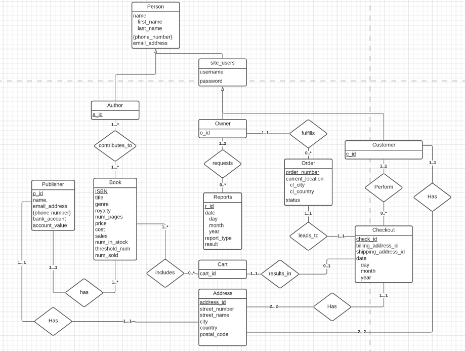

# ERD

## Assumptions
- Carts are only every generated after user adds a book
- Therefore, Carts must have atleast one book
- A single Book has a single publisher
- All publishers and all persons could have mnay phone numbers
- Not all Carts will be converted to Checkouts
- All Checkouts are converted to Orders (no failed checkouts)
- A Book can have many Authors
- Authors, Owners, and Customers all share Person attributes
- Owners must request Reports
- An Owner is responsible for fulfilling any orders
- A customer is only added to the DB if they choose to register
- A customer will only be prompted to register at Checkout
- A customer can opt not to check out, even after registering
- A customer must be registered in order to Checkout