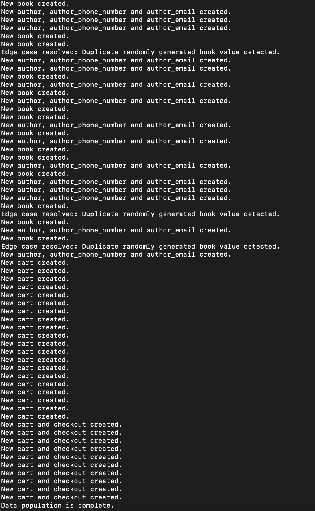
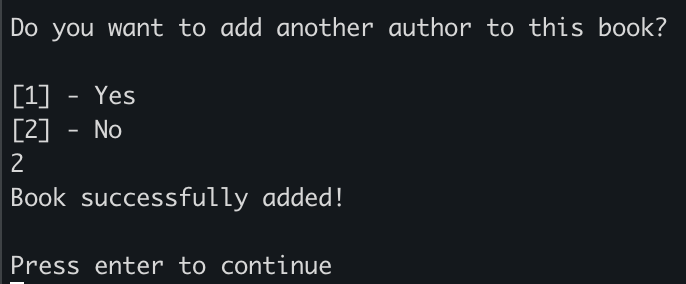

# Book Store Project COMP3005 FALL 2021
Joshua Kline - 101125043

Eric Herscovich - 101196704

# Conceptual Design

## ERD

## Assumptions
- Carts are only every generated after user adds a book
- Therefore, Carts must have atleast one book
- A single Book has a single publisher
- All publishers and all persons could have many phone numbers
- Not all Carts will be converted to Checkouts
- All Checkouts are converted to Orders (no failed checkouts)
- A Book can have many Authors
- Authors, Owners, and Customers all share Person attributes
- Owners must request Reports
- An Owner is responsible for fulfilling all orders
- A customer is only added to the DB if they choose to register
- A customer will only be prompted to register at Checkout
- An owner must log in before accessing the owner menu
- A customer can opt not to check out, even after registering
- A customer must be registered in order to Checkout
- An email must belong to one and only one customer. Two people cannot share an email.
- A customer has two addresses attributed to them. A billing and shipping address.
- A checkout also has two addresses, a billing and shipping address.
- A publisher only has one address, their billing address.

# Reduction to Relational Schema (No Normalization)

'*' = FK

**book**(<ins>ISBN</ins>, p_id*, title, genre, royalty, num_pages, price, cost, num_in_stock, threshold_num, num_sold)

**cart**(<ins>c_id</ins>)

**cart_books**(<ins>c_id</ins>, <ins>ISBN</ins>)

**author_phone_number**( <ins>a_id</ins>, <ins>phone_number</ins>)

**owner_phone_number**( <ins>o_id</ins>, <ins>phone_number</ins>)

**customer_phone_number**( <ins>c_id</ins>, <ins>phone_number</ins>)

**author**(<ins>a_id</ins>, first_name, last_name, email_address)

**book_authors**(<ins>ISBN</ins>, <ins>a_id</ins>)

**publisher**(<ins>p_id</ins>, address_id*, name, email_address, bank_account , account_value)

**publisher_phone_number**( <ins>p_id</ins>, <ins>phone_number</ins>)

**owner**( <ins>o_id</ins>, first_name, last_name, email_address, username, password)

**reports**( <ins>r_id</ins>, o_id*, day, month, year, report_type, result)

**order**( <ins>order_number</ins> , o_id*, check_id*, cl_city, cl_country, status)

**customer**( <ins>c_id</ins>, shipping_address_id*, billing_address_id*, first_name, last_name, email_address, username, password)

**checkout**( <ins>check_id</ins>, billing_address*, shipping_address*, c_id*, cart_id*, day, month, year)

**address**(<ins>address_id</ins>, street_number, street_name, city, country, postal_code)

---

# Normalization of Relational Schemas

## Functional Dependencies 

---

**Fbook** = {
  
  &nbsp;&nbsp; ISBN &rarr; (p_id, title, genre, royalty, num_pages, price, cost, num_in_stock, threshold_num, num_sold)
  
  }

---

**Fauthor** = {

  &nbsp;&nbsp; a_id &rarr; (first_name, last_name, email_address),

  &nbsp;&nbsp; email_address &rarr; (first_name, last_name)
 
}

---

**Fpublisher** = {

  &nbsp;&nbsp; p_id &rarr; (address_id, name, email_address, bank_account , account_value),

  &nbsp;&nbsp; email_address &rarr; name,

  &nbsp;&nbsp; bank_account &rarr; account_value

}

---

**Fowner** = {

  &nbsp;&nbsp; o_id &rarr; (first_name, last_name, email_address, username, password),

  &nbsp;&nbsp; email_address &rarr; (first_name, last_name),

  &nbsp;&nbsp; (username, password) &rarr; o_id

}

---

**Freports** = {

  &nbsp;&nbsp; r_id &rarr; (o_id, day, month, year, report_type, result)
  
}

---

**Forder** = {

  &nbsp;&nbsp; order_number &rarr; (o_id, check_id, cl_city, cl_country, status)
  
}

---

**Fcustomer** = {

  &nbsp;&nbsp; c_id &rarr; (shipping_address_id, billing_address_id, first_name, last_name, email_address, username, password),
  
  &nbsp;&nbsp; email_address &rarr; (first_name, last_name),

  &nbsp;&nbsp; (username, password) &rarr; c_id

}

---

**Fcheckout** = {

  &nbsp;&nbsp; check_id &rarr; (shipping_address_id, billing_address_id, c_id, cart_id, day, month, year)

}

---

**Faddress** = {

  &nbsp;&nbsp; address_id &rarr; (street_number, street_name, city, country, postal_code),

  &nbsp;&nbsp; postal_code &rarr; (city, country)

}

---

## Normalization into 3NF

1) If there exists FD's in Fc such that $\alpha$ 1 &rarr; $\beta$ 1 and $\alpha$ 1 &rarr; $\beta$ 2, remove them all and replace them with their union $\alpha$ 1 &rarr; $\beta$ 1 $\beta$ 2
2) Test each FD in Fc for extraneous attributes, remove those that are found from Fc
3) For each FD in Fc, derive Ri = $\alpha$ $\beta$
4) Check that atleast one of the derived relations Ri contains a candidate key for R. If none do, derive one that does
5) Check if any relation Rj is a subset of any other relation Rk, remove Rj

---
### Book 

book = {ISBN, p_id, title, genre, royalty, num_pages, price, cost, num_in_stock, threshold_num, num_sold}

F = {
  
  &nbsp;&nbsp; ISBN &rarr; (p_id, title, genre, royalty, num_pages, price, cost, num_in_stock, threshold_num, num_sold)

}

Fc = F

Fc = {

  &nbsp;&nbsp; ISBN &rarr; (p_id, title, genre, royalty, num_pages, price, cost, num_in_stock, threshold_num, num_sold)

}

1) Since there exists only 1 FD, no union can be formed
2) Since there exists only 1 FD, none of the attributes can be extraneous, therefore nothing to remove from Fc
3) Therefore, R1 = {ISBN, p_id, title, genre, royalty, num_pages, price, cost, num_in_stock, threshold_num, num_sold}
4) ISBN from R1 is a candidate key for the relation book
5) R1 is the only relation, and therefore is not a subset of any other relation

The relation book therefore satisfies 3NF, and is in good normal form. No decomposition required.

**book**(<ins>ISBN</ins>, p_id*, title, genre, royalty, num_pages, price, cost, num_in_stock, threshold_num, num_sold)

---
### Cart

cart = {cart_id}

F = { }

Fc = F

Fc = { }

1) Since there exists 0 FD's, no union can be formed
2) Since there exists 0 FD's, none of the attributes can be extraneous, therefore nothing to remove from Fc
3) Therefore, R1 = {cart_id} as cart_id &rarr; cart_id is the only inferrable (trivial) FD
4) cart_id from R1 is a candidate key for the relation cart
5) R1 is the only relation, and therefore is not a subset of any other relation

The relation cart therefore satisfies 3NF, and is in good normal form. No decomposition required.

**cart**(<ins>cart_id</ins>)

---
### Cart_Books

cart_books = (cart_id, ISBN)

F = { }

Fc = F

Fc = { }

1) Since there exists 0 FD's, no union can be formed
2) Since there exists 0 FD's, none of the attributes can be extraneous, therefore nothing to remove from Fc
3) Therefore, R1 = {cart_id, ISBN} as (cart_id, ISBN) &rarr; (cart_id, ISBN) is the only inferrable (trivial) FD
4) (cart_id, ISBN) from R1 is a candidate key for the relation cart_books
5) R1 is the only relation, and therefore is not a subset of any other relation

The relation cart_books therefore satisfies 3NF, and is in good normal form. No decomposition required.

**cart_books**(<ins>cart_id</ins>, <ins>ISBN</ins>)

---
### Author_Phone_Number

author_phone_number = (a_id, phone_number)

F = { }

Fc = F

Fc = { }

1) Since there exists 0 FD's, no union can be formed
2) Since there exists 0 FD's, none of the attributes can be extraneous, therefore nothing to remove from Fc
3) Therefore, R1 = {a_id, phone_number} as (a_id, phone_number) &rarr; (a_id, phone_number) is the only inferrable (trivial) FD
4) (a_id, phone_number) from R1 is a candidate key for the relation author_phone_number
5) R1 is the only relation, and therefore is not a subset of any other relation

The relation author_phone_number therefore satisfies 3NF, and is in good normal form. No decomposition required.

**author_phone_number**( <ins>a_id</ins>, <ins>phone_number</ins>)

---
### Owner_Phone_Number

owner_phone_number = (o_id, phone_number)

F = { }

Fc = F

Fc = { }

1) Since there exists 0 FD's, no union can be formed
2) Since there exists 0 FD's, none of the attributes can be extraneous, therefore nothing to remove from Fc
3) Therefore, R1 = {o_id, phone_number} as (o_id, phone_number) &rarr; (o_id, phone_number) is the only inferrable (trivial) FD
4) (o_id, phone_number) from R1 is a candidate key for the relation owner_phone_number
5) R1 is the only relation, and therefore is not a subset of any other relation

The relation owner_phone_number therefore satisfies 3NF, and is in good normal form. No decomposition required.

**owner_phone_number**( <ins>o_id</ins>, <ins>phone_number</ins>)

---
### Customer_Phone_Number

customer_phone_number = (c_id, phone_number)

F = { }

Fc = F

Fc = { }

1) Since there exists 0 FD's, no union can be formed
2) Since there exists 0 FD's, none of the attributes can be extraneous, therefore nothing to remove from Fc
3) Therefore, R1 = {c_id, phone_number} as (c_id, phone_number) &rarr; (c_id, phone_number) is the only inferrable (trivial) FD
4) (c_id, phone_number) from R1 is a candidate key for the relation customer_phone_number
5) R1 is the only relation, and therefore is not a subset of any other relation

The relation customer_phone_number therefore satisfies 3NF, and is in good normal form. No decomposition required.

**customer_phone_number**( <ins>c_id</ins>, <ins>phone_number</ins>)

---
### Author

author = {a_id, first_name, last_name, email_address}

F = {

&nbsp;&nbsp; a_id &rarr; (first_name, last_name, email_address),

&nbsp;&nbsp; email_address &rarr; (first_name, last_name))

}

Fc = F

Fc = {

&nbsp;&nbsp; a_id &rarr; (first_name, last_name, email_address),

&nbsp;&nbsp; email_address &rarr; (first_name, last_name)

}

1) No two FD's have the same $\alpha$ , therefore no union can be formed
2) Testing for Extraneous Attributes

   * Case for a_id &rarr; (first_name, last_name, email_address)

      *  Is first_name extraneous in a_id &rarr; (first_name, last_name, email_address) ?

          * Replace a_id &rarr; (first_name, last_name, email_address) with a_id &rarr; (last_name, email_address)

          * a_id+ = { } 

            1) a_id &rarr; a_id : a_id+ = { a_id }
            2) a_id &rarr; (last_name, email_address) : a_id+ = { a_id, last_name, email_address}
            3) email_address &rarr; (first_name, last_name) : a_id+ = {last_name, email_address, first_name}

              * Since first_name can be found in a_id+ , it is extraneous. We will replace the FD a_id &rarr; (first_name, last_name, email_address) with the FD a_id &rarr; (last_name, email_address) in Fc

                * Therefore, the new adjusted Canonical Cover
                
                Fc = {

                  a_id --> (last_name, email_address),

                  email_address --> (first_name, last_name),

                }

      *  Is last_name extraneous in a_id &rarr; (last_name, email_address) ?

          * Replace a_id &rarr; (last_name, email_address) with a_id &rarr; (email_address)

          * a_id+ = { } 

            1) a_id &rarr; a_id : a_id+ = { a_id }
            2) a_id &rarr; (email_address) : a_id+ = { a_id, email_address }
            3) email_address &rarr; (first_name, last_name) : a_id+ = {email_address, first_name, last_name}

              * Since last_name can be found in a_id+ , it is extraneous. We will replace the FD a_id &rarr; (last_name, email_address) with the FD a_id &rarr; (email_address) in Fc

                * Therefore, the new adjusted Canonical Cover
                
                Fc = {

                  a_id --> (email_address),

                  email_address --> (first_name, last_name),

                }

      *  Is email_address extraneous in a_id &rarr; (email_address) ?

          * Since there is only 1 attribute on either the LHS and RHS, neither can be extraneous.

    * Case for email_address &rarr; (first_name, last_name)

      * Is first_name extraneous in email_address &rarr; (first_name, last_name) ?

          * Replace email_address &rarr; (first_name, last_name) with email_address &rarr; (last_name)

          * email_address+ = { } 

            1) email_address &rarr; email_address : email_address+ = { email_address }
            2) email_address &rarr; (last_name) : email_address+ = { email_address, last_name }

              * Nothing else can be inferred, since first_name is not in p_id+, first_name is not an extraneous attribute, and must stay in the FD

      * Is last_name extraneous in email_address &rarr; (first_name, last_name) ?

          * Replace email_address &rarr; (first_name, last_name) with email_address &rarr; (first_name)

          * email_address+ = { } 

            1) email_address &rarr; email_address : email_address+ = { email_address }
            2) email_address &rarr; (first_name) : email_address+ = { email_address, first_name }

              * Nothing else can be inferred, since last_name is not in p_id+, last_name is not an extraneous attribute, and must stay in the FD

3) Therefore, R1 = {a_id, email_address} and R2 = {email_address, first_name, last_day}
4) a_id from R1 is a candidate key for the relation author
5) Neither of the above relations are subsets of one another, so they will both persist.

**author**(<ins>a_id</ins>, email_address*)

**author_email**(<ins>email_address</ins>, first_name, last_name)

---
### Book_Authors

book_authors = (ISBN, a_id)

F = { }

Fc = F

Fc = { }

1) Since there exists 0 FD's, no union can be formed
2) Since there exists 0 FD's, none of the attributes can be extraneous, therefore nothing to remove from Fc
3) Therefore, R1 = {ISBN, a_id} as (ISBN, a_id) &rarr; (ISBN, a_id) is the only inferrable (trivial) FD
4) (ISBN, a_id) from R1 is a candidate key for the relation book_authors
5) R1 is the only relation, and therefore is not a subset of any other relation

The relation book_authors therefore satisfies 3NF, and is in good normal form. No decomposition required.

**book_authors**(<ins>ISBN</ins>, <ins>a_id</ins>)

---
### Publisher

publisher = (p_id, address_id*, name, email_address, bank_account, account_value)

F = {

  &nbsp;&nbsp; p_id &rarr; (address_id, name, email_address, bank_account , account_value),

  &nbsp;&nbsp; email_address &rarr; (name),

  &nbsp;&nbsp; bank_account &rarr; account_value

}

Fc = F

Fc = {

  &nbsp;&nbsp; p_id &rarr; (address_id, name, email_address, bank_account , account_value),

  &nbsp;&nbsp; email_address &rarr; (name),

  &nbsp;&nbsp; bank_account &rarr; account_value

}

1) No two FD's have the same $\alpha$ , therefore no union can be formed
2) Testing for Extraneous Attributes

    * Case for p_id &rarr; (address_id, name, email_address, bank_account , account_value)

        * Is address_id extraneous in p_id &rarr; (address_id, name, email_address, bank_account , account_value) ?

            * Replace p_id &rarr; (address_id, name, email_address, bank_account , account_value) with p_id &rarr; (name, email_address, bank_account , account_value)

            * p_id+ = { } 

              1) p_id &rarr; p_id : p_id+ = { p_id }
              2) p_id &rarr; (name, email_address, bank_account , account_value) : p_id+ = { p_id, name, email_address, bank_account , account_value }

                * Nothing else can be inferred, since address_id is not in p_id+, address_id is not an extraneous attribute, and must stay in the FD

        * Is name extraneous in p_id &rarr; (address_id, name, email_address, bank_account , account_value) ?

            * Replace p_id &rarr; (address_id, name, email_address, bank_account , account_value) with p_id &rarr; (address_id, email_address, bank_account , account_value)

            * p_id+ = { } 

              1) p_id &rarr; p_id : p_id+ = { p_id }
              2) p_id &rarr; (address_id, email_address, bank_account , account_value) : p_id+ = { p_id, address_id, email_address, bank_account , account_value }
              3) email_address &rarr; (name) : p_id+ = { p_id, address_id, email_address, bank_account, account_value, name }

                * Since name can be found in p_id+ , it is extraneous. We will replace the FD p_id &rarr; (address_id, name, email_address, bank_account , account_value) with the FD p_id &rarr; (address_id, email_address, bank_account , account_value) in Fc

                * Therefore, the new adjusted Canonical Cover
                
                Fc = {

                  p_id --> (address_id, email_address, bank_account , account_value),

                  email_address --> (name),

                  bank_account --> account_value

                }

        * Is email_address extraneous in p_id &rarr; (address_id, email_address, bank_account, account_value) ?

            * Replace p_id &rarr; (address_id, email_address, bank_account, account_value) with p_id &rarr; (address_id, bank_account, account_value)

            * p_id+ = { } 

              1) p_id &rarr; p_id : p_id+ = { p_id }
              2) p_id &rarr; (address_id, bank_account, account_value) : p_id+ = { p_id, address_id, bank_account, account_value }

                * Nothing else can be inferred, since email_address is not in p_id+, email_address is not an extraneous attribute, and must stay in the FD

        * Is bank_account extraneous in p_id &rarr; (address_id, email_address, bank_account, account_value) ?

            * Replace p_id &rarr; (address_id, email_address, bank_account, account_value) with p_id &rarr; (address_id, email_address, account_value)

            * p_id+ = { } 

              1) p_id &rarr; p_id : p_id+ = { p_id }
              2) p_id &rarr; (address_id, email_address, account_value) : p_id+ = { p_id, address_id, email_address, account_value }
              3) email_address &rarr; name : p_id+ = { p_id, address_id, email_address, account_value, name }

                * Nothing else can be inferred, since bank_account is not in p_id+, bank_account is not an extraneous attribute, and must stay in the FD

        * Is account_value extraneous in p_id &rarr; (address_id, email_address, bank_account, account_value) ?

            * Replace p_id &rarr; (address_id, email_address, bank_account, account_value) with p_id &rarr; (address_id, email_address, bank_account)

            * p_id+ = { } 

              1) p_id &rarr; p_id : p_id+ = { p_id }
              2) p_id &rarr; (address_id, email_address, bank_account) : p_id+ = { p_id, address_id, email_address, bank_account }
              3) email_address &rarr; name : p_id+ = { p_id, address_id, email_address, bank_account, name }
              4) bank_account &rarr; account_value : p_id+ = { p_id, address_id, email_address, bank_account, name, account_value }

                * Since account_value can be found in p_id+ , it is extraneous. We will replace the FD p_id &rarr; (address_id, email_address, bank_account, account_value) with the FD p_id &rarr; (address_id, email_address, bank_account) in Fc

                * Therefore, the new adjusted Canonical Cover

                Fc = {

                  p_id --> (address_id, email_address, bank_account),

                  email_address --> name,

                  bank_account --> account_value

                }

    * Case for email_address &rarr; name

        * Since there is only 1 attribute on either the LHS and RHS, no attributes in this FD can be extraneous. 

    * Case for bank_account &rarr; account_value

        * Since there is only 1 attribute on either the LHS and RHS, no attributes in this FD can be extraneous.

3) Therefore, R1 = {p_id, address_id, email_address, bank_account}, R2 = {email_address, name}, and R3 = {bank_account, account_value }
4) p_id from R1 is a candidate key for the relation book_authors
5) None of R1, R2, or R3 are subsets of one another, so we must decompose the relation publsiher into three new relations. These will be the schemas for the new relations...

**publisher** (<ins>p_id</ins>, address_id*, email_address*, bank_account*)

**publisher_email** (<ins>email_address</ins>, name)

**publisher_bank** (<ins>bank_account</ins>, account_value)

---
### Publisher_Phone_Number

publisher_phone_number = {p_id, phone_number}

F = { }

Fc = F

Fc = { }

1) Since there exists 0 FD's, no union can be formed
2) Since there exists 0 FD's, none of the attributes can be extraneous, therefore nothing to remove from Fc
3) Therefore, R1 = {p_id, phone_number} as (p_id, phone_number) &rarr; (p_id, phone_number) is the only inferrable (trivial) FD
4) (p_id, phone_number) from R1 is a candidate key for the relation publisher_phone_number
5) R1 is the only relation, and therefore is not a subset of any other relation

The relation publisher_phone_number therefore satisfies 3NF, and is in good normal form. No decomposition required.

**publisher_phone_number**( <ins>p_id</ins>, <ins>phone_number</ins>)

---
### Owner

owner = {o_id, first_name, last_name, email_address, username, password}

F = {

  &nbsp;&nbsp; o_id &rarr; (first_name, last_name, email_address, username, password),

  &nbsp;&nbsp; email_address &rarr; (first_name, last_name),

  &nbsp;&nbsp; (username, password) &rarr; o_id

}

Fc = F

Fc = {

  &nbsp;&nbsp; o_id &rarr; (first_name, last_name, email_address, username, password),

  &nbsp;&nbsp; email_address &rarr; (first_name, last_name),

  &nbsp;&nbsp; (username, password) &rarr; o_id

}

1) No two FD's have the same $\alpha$ , therefore no union can be formed
2) Testing for Extraneous Attributes

    * Case for o_id &rarr; (first_name, last_name, email_address, username, password)

        * Is first_name extraneous in o_id &rarr; (first_name, last_name, email_address, username, password) ?

            * Replace o_id &rarr; (first_name, last_name, email_address, username, password) with o_id &rarr; (last_name, email_address, username, password)

            * o_id+ = { } 

              1) o_id &rarr; o_id : o_id+ = { o_id }
              2) o_id &rarr; (last_name, email_address, username, password) : o_id+ = { o_id, last_name, email_address, username, password }
              3) email_address &rarr; (first_name, last_name) : o_id+ = { o_id, last_name, email_address, username, password, first_name }

                * Since first_name can be found in o_id+ , it is extraneous. We will replace the FD o_id &rarr; (first_name, last_name, email_address, username, password) with the FD o_id &rarr; (last_name, email_address, username, password) in Fc

                * Therefore, the new adjusted Canonical Cover

                Fc = {

                  o_id --> (last_name, email_address, username, password),

                  email_address --> (first_name, last_name),

                  (username, password) --> o_id

                }

        * Is last_name extraneous in o_id &rarr; (last_name, email_address, username, password) ?

            * Replace o_id &rarr; (last_name, email_address, username, password) with o_id &rarr; (email_address, username, password)

            * o_id+ = { } 

              1) o_id &rarr; o_id : o_id+ = { o_id }
              2) o_id &rarr; (email_address, username, password) : o_id+ = { o_id, email_address, username, password }
              3) email_address &rarr; (first_name, last_name) : o_id+ = { o_id, email_address, username, password, first_name, last_name}

                * Since last_name can be found in o_id+ , it is extraneous. We will replace the FD o_id &rarr; (last_name, email_address, username, password) with the FD o_id &rarr; (email_address, username, password) in Fc

                * Therefore, the new adjusted Canonical Cover

                Fc = {

                  o_id --> (email_address, username, password),

                  email_address --> (first_name, last_name),

                  (username, password) --> o_id

                }

        * Is email_address extraneous in o_id &rarr; (email_address, username, password) ?

            * Replace o_id &rarr; (email_address, username, password) with o_id &rarr; (username, password)

            * o_id+ = { } 

              1) o_id &rarr; o_id : o_id+ = { o_id }
              2) o_id &rarr; (username, password) : o_id+ = { o_id, username, password }

                * Nothing else can be inferred, since email_address is not in o_id+, email_address is not an extraneous attribute, and must stay in the FD

        * Is username extraneous in o_id &rarr; (email_address, username, password) ?

            * Replace o_id &rarr; (email_address, username, password) with o_id &rarr; (email_address, password)

            * o_id+ = { } 

              1) o_id &rarr; o_id : o_id+ = { o_id }
              2) o_id &rarr; (email_address, password) : o_id+ = { o_id, email_address, password }
              3) email_address &rarr; (first_name, last_name) : p_id+ = {o_id, email_address, password, first_name, last_name }

                * Nothing else can be inferred, since username is not in o_id+, username is not an extraneous attribute, and must stay in the FD

        * Is password extraneous in o_id &rarr; (email_address, username, password) ?

            * Replace o_id &rarr; (email_address, username, password) with o_id &rarr; (email_address, username)

            * o_id+ = { } 

              1) o_id &rarr; o_id : o_id+ = { o_id }
              2) o_id &rarr; (email_address, username) : o_id+ = { o_id, email_address, username }
              3) email_address &rarr; (first_name, last_name) : p_id+ = {o_id, email_address, username, first_name, last_name }

                * Nothing else can be inferred, since password is not in o_id+, password is not an extraneous attribute, and must stay in the FD

    * Case for email_address &rarr; (first_name, last_name)

        * Is first_name extraneous in email_address &rarr; (first_name, last_name) ?

            * Replace email_address &rarr; (first_name, last_name) with email_address &rarr; last_name

            * email_address+ = { } 

              1) email_address &rarr; email_address : email_address+ = { email_address }
              2) email_address &rarr; last_name : email_address+ = { email_address, last_name, }

                * Nothing else can be inferred, since first_name is not in email_address+, first_name is not an extraneous attribute, and must stay in the FD

        * Is last_name extraneous in email_address &rarr; (first_name, last_name) ?

            * Replace email_address &rarr; (first_name, last_name) with email_address &rarr; first_name

            * email_address+ = { } 

              1) email_address &rarr; email_address : email_address+ = { email_address }
              2) email_address &rarr; first_name : email_address+ = {email_address, first_name}

                * Nothing else can be inferred, since last_name is not in email_address+, last_name is not an extraneous attribute, and must stay in the FD
          
    * Case for (username, password) &rarr; o_id

        * Is username extraneous in (username, password) &rarr; o_id ?

            * Can we imply password &rarr; o_id

            * password+ = { } 

                1) password &rarr; password : password+ = { password }
            
                * Nothing else can be inferred, since password alone cannot imply o_id, username must stay in the FD.

        * Is password extraneous in (username, password) &rarr; o_id ?

            * Can we imply username &rarr; o_id

            * username+ = { } 

                1) username &rarr; username : username+ = { username }
            
                * Nothing else can be inferred, since username alone cannot imply o_id, password must stay in the FD.

3) Therefore, R1 = {o_id, email_address, username, password}, R2 = {email_address, first_name, last_name}, and R3 = {o_id, username, password}.
4) o_id from R1 is a candidate key for the relation owner
5) R3 is a subset of R1, so it will be deleted, R1 and R2 will persist and be the product of this decomposition... 

**owner**( <ins>o_id</ins>, email_address*, username, password)

**owner_email**( <ins>email_address</ins>, first_name, last_name)

---
### Reports

reports = (r_id, o_id, day, month, year, report_type, result)

F = {

  &nbsp;&nbsp; r_id &rarr; (o_id, day, month, year, report_type, result)
  
}

Fc = F

Fc = {

  &nbsp;&nbsp; r_id &rarr; (o_id, day, month, year, report_type, result)

}

1) Since there exists only 1 FD, no union can be formed
2) Since there exists only 1 FD, none of the attributes can be extraneous, therefore nothing to remove from Fc
3) Therefore, R1 = {r_id, o_id, day, month, year, report_type, result}
4) r_id from R1 is a candidate key for the relation reports
5) R1 is the only relation, and therefore is not a subset of any other relation

The relation reports therefore satisfies 3NF, and is in good normal form. No decomposition required.

**reports**( <ins>r_id</ins>, o_id*, day, month, year, report_type, result)

---
### Order

order = (order_number, o_id, check_id, cl_city, cl_country, status)

F = {

  &nbsp;&nbsp; order_number &rarr; (o_id, check_id, cl_city, cl_country, status)
  
}

Fc = F

Fc = {

  &nbsp;&nbsp; order_number &rarr; (o_id, check_id, cl_city, cl_country, status)

}

1) Since there exists only 1 FD, no union can be formed
2) Since there exists only 1 FD, none of the attributes can be extraneous, therefore nothing to remove from Fc
3) Therefore, R1 = {order_number, o_id, check_id, cl_city, cl_country, status}
4) order_number from R1 is a candidate key for the relation order
5) R1 is the only relation, and therefore is not a subset of any other relation

The relation order therefore satisfies 3NF, and is in good normal form. No decomposition required.

**order**( <ins>order_number</ins> , o_id*, check_id*, cl_city, cl_country, status)

---
### Customer 

customer = (c_id, shipping_address_id*, billing_address_id*, first_name, last_name, email_address, username, password)

F = {

  &nbsp;&nbsp; c_id &rarr; (shipping_address_id, billing_address_id, first_name, last_name, email_address, username, password),
  
  &nbsp;&nbsp; email_address &rarr; (first_name, last_name),

  &nbsp;&nbsp; (username, password) &rarr; c_id

}

Fc = F

Fc = {

  &nbsp;&nbsp; c_id &rarr; (shipping_address_id, billing_address_id, first_name, last_name, email_address, username, password),
  
  &nbsp;&nbsp; email_address &rarr; (first_name, last_name),

  &nbsp;&nbsp; (username, password) &rarr; c_id

}

1) No two FD's have the same $\alpha$ , therefore no union can be formed
2) Testing for Extraneous Attributes

    * Case for c_id &rarr; (shipping_address_id, billing_address_id, first_name, last_name, email_address, username, password)

        * Is shipping_address_id extraneous in c_id &rarr; (shipping_address_id, billing_address_id, first_name, last_name, email_address, username, password) ?

            * Replace c_id &rarr; (shipping_address_id, billing_address_id, first_name, last_name, email_address, username, password) with c_id &rarr; ( billing_address_id, first_name, last_name, email_address, username, password)

            * c_id+ = { } 

              1) c_id &rarr; c_id : c_id+ = { c_id }
              2) c_id &rarr; ( billing_address_id, first_name, last_name, email_address, username, password) : c_id+ = { c_id, billing_address_id, first_name, last_name, email_address, username, password }

                * Nothing else can be inferred, since shipping_address_id is not in c_id+, shipping_address_id is not an extraneous attribute, and must stay in the FD

        * Is billing_address_id extraneous in c_id &rarr; (shipping_address_id, billing_address_id, first_name, last_name, email_address, username, password) ?

            * Replace c_id &rarr; (shipping_address_id, billing_address_id, first_name, last_name, email_address, username, password) with c_id &rarr; ( shipping_address_id, first_name, last_name, email_address, username, password)

            * c_id+ = { } 

              1) c_id &rarr; c_id : c_id+ = { c_id }
              2) c_id &rarr; ( shipping_address_id, first_name, last_name, email_address, username, password) : c_id+ = { c_id, shipping_address_id, first_name, last_name, email_address, username, password }

                * Nothing else can be inferred, since billing_address_id is not in c_id+, billing_address_id is not an extraneous attribute, and must stay in the FD

        * Is first_name extraneous in c_id &rarr; (shipping_address_id, billing_address_id, first_name, last_name, email_address, username, password) ?

            * Replace c_id &rarr; (shipping_address_id, billing_address_id, first_name, last_name, email_address, username, password) with c_id &rarr; ( shipping_address_id, billing_address, last_name, email_address, username, password)

            * c_id+ = { } 

              1) c_id &rarr; c_id : c_id+ = { c_id }
              2) c_id &rarr; ( shipping_address_id, billing_address, last_name, email_address, username, password) : c_id+ = { c_id, shipping_address_id, billing_address, last_name, email_address, username, password }
              3) email_address &rarr; (first_name, last_name : c_id+ = { c_id, shipping_address_id, billing_address, last_name, email_address, username, password, first_name }

                * Since first_name can be found in c_id+ , it is extraneous. We will replace the FD c_id &rarr; (shipping_address_id, billing_address_id, first_name, last_name, email_address, username, password) with the FD c_id &rarr; ( shipping_address_id, billing_address, last_name, email_address, username, password) in Fc

                * Therefore, the new adjusted Canonical Cover

                Fc = {

                  c_id --> (shipping_address_id, billing_address_id, last_name, email_address, username, password),
                  
                  email_address --> (first_name, last_name),

                  (username, password) --> c_id

                }

        * Is last_name extraneous in c_id &rarr; (shipping_address_id, billing_address_id, last_name, email_address, username, password) ?

            * Replace c_id &rarr; (shipping_address_id, billing_address_id, last_name, email_address, username, password) with c_id &rarr; (shipping_address_id, billing_address_id, email_address, username, password)

            * c_id+ = { } 

              1) c_id &rarr; c_id : c_id+ = { c_id }
              2) c_id &rarr; ( shipping_address_id, billing_address, email_address, username, password) : c_id+ = { c_id, shipping_address_id, billing_address, email_address, username, password }
              3) email_address &rarr; (first_name, last_name) : c_id+ = { c_id, shipping_address_id, billing_address, email_address, username, password, first_name, last_name }

                * Since last_name can be found in c_id+ , it is extraneous. We will replace the FD c_id &rarr; (shipping_address_id, billing_address_id, last_name, email_address, username, password) with the FD c_id &rarr; (shipping_address_id, billing_address_id, email_address, username, password) in Fc

                * Therefore, the new adjusted Canonical Cover

                Fc = {

                  c_id --> (shipping_address_id, billing_address_id, email_address, username, password),
                  
                  email_address --> (first_name, last_name),

                  (username, password) --> c_id

                }

        * Is email_address extraneous in c_id &rarr; (shipping_address_id, billing_address_id, email_address, username, password) ?

            * Replace c_id &rarr; (shipping_address_id, billing_address_id, email_address, username, password) with c_id &rarr; (shipping_address_id, billing_address_id, username, password)

            * c_id+ = { } 

              1) c_id &rarr; c_id : c_id+ = { c_id }
              2) c_id &rarr; ( shipping_address_id, billing_address, username, password) : c_id+ = { c_id, shipping_address_id, billing_address, username, password }

                *  Nothing else can be inferred, since email_address is not in c_id+, email_address is not an extraneous attribute, and must stay in the FD

        * Is username extraneous in c_id &rarr; (shipping_address_id, billing_address_id, email_address, username, password) ?

            * Replace c_id &rarr; (shipping_address_id, billing_address_id, email_address, username, password) with c_id &rarr; (shipping_address_id, billing_address_id, email_address, password)

            * c_id+ = { } 

              1) c_id &rarr; c_id : c_id+ = { c_id }
              2) c_id &rarr; ( shipping_address_id, billing_address, email_address, password) : c_id+ = { c_id, shipping_address_id, billing_address, email_address, password }
              3) email_address --> (first_name, last_name) : c_id+ = { c_id, shipping_address_id, billing_address, email_address, password, first_name, last_name }

                *  Nothing else can be inferred, since username is not in c_id+, username is not an extraneous attribute, and must stay in the FD

        * Is password extraneous in c_id &rarr; (shipping_address_id, billing_address_id, email_address, username, password) ?

            * Replace c_id &rarr; (shipping_address_id, billing_address_id, email_address, username, password) with c_id &rarr; (shipping_address_id, billing_address_id, email_address, username)

            * c_id+ = { } 

              1) c_id &rarr; c_id : c_id+ = { c_id }
              2) c_id &rarr; ( shipping_address_id, billing_address, email_address, username) : c_id+ = { c_id, shipping_address_id, billing_address, email_address, username }
              3) email_address --> (first_name, last_name) : c_id+ = { c_id, shipping_address_id, billing_address, email_address, username, first_name, last_name }

                *  Nothing else can be inferred, since password is not in c_id+, password is not an extraneous attribute, and must stay in the FD

    * Case for email_address &rarr; (first_name, last_name)

        * Is first_name extraneous in email_address &rarr; (first_name, last_name) ?

            * Replace email_address &rarr; (first_name, last_name) with email_address &rarr; last_name

            * email_address+ = { } 

              1) email_address &rarr; email_address : email_address+ = { email_address }
              2) email_address &rarr; last_name : email_address+ = { email_address, last_name }

                * Nothing else can be inferred, since first_name is not in email_address+, first_name is not an extraneous attribute, and must stay in the FD

        * Is last_name extraneous in email_address &rarr; (first_name, last_name) ?

            * Replace email_address &rarr; (first_name, last_name) with email_address &rarr; first_name

            * email_address+ = { } 

              1) email_address &rarr; email_address : email_address+ = { email_address }
              2) email_address &rarr; first_name : email_address+ = { email_address, first_name}

                * Nothing else can be inferred, since last_name is not in email_address+, last_name is not an extraneous attribute, and must stay in the FD

    * Case for (username, password) &rarr; c_id

        * Is username extraneous in (username, password) &rarr; c_id ?

            * Can we imply password &rarr; c_id ?

            * password+ = { } 

              1) password &rarr; password : password+ = { password }

                * Nothing else can be inferred, since password alone cannot imply c_id, username is not an extraneous attribute, and must stay in the FD

        * Is password extraneous in (username, password) &rarr; c_id ?

            * Can we imply username &rarr; c_id ?

            * username+ = { } 

              1) username &rarr; username : username+ = { username }

                * Nothing else can be inferred, since username alone cannot imply c_id, password is not an extraneous attribute, and must stay in the FD

3) Therefore, R1 = {c_id, shipping_address_id, billing_address_id, email_address, username, password}, R2 = {email_address, first_name, last_name}, and R3 = {username, password, c_id}.
4) c_id from R1 is a candidate key for the relation customer
5) R3 is a subset of R1, so it will be deleted, but R1 and R2 will persist and be the product of this decomposition...

**customer**( <ins>c_id</ins>, shipping_address_id*, billing_address_id*, email_address*, username, password)

**customer_email** (<ins>email_address</ins> , first_name, last_name)

---
### Checkout 

checkout = (check_id, billing_address, shipping_address, c_id, cart_id, day, month, year)

F = {

  &nbsp;&nbsp; check_id &rarr; (shipping_address_id, billing_address_id, c_id, cart_id, day, month, year)

}

Fc = F

Fc = {

  &nbsp;&nbsp; check_id &rarr; (shipping_address_id, billing_address_id, c_id, cart_id, day, month, year)

}

1) Since there exists only 1 FD, no union can be formed
2) Since there exists only 1 FD, none of the attributes can be extraneous, therefore nothing to remove from Fc
3) Therefore, R1 = {check_id, shipping_address_id, billing_address_id, c_id, cart_id, day, month, year}
4) check_id from R1 is a candidate key for the relation checkout
5) R1 is the only relation, and therefore is not a subset of any other relation

The relation checkout therefore satisfies 3NF, and is in good normal form. No decomposition required.

**checkout**( <ins>check_id</ins>, billing_address_id*, shipping_address_id*, c_id*, cart_id*, day, month, year)

---
### Address

address = (address_id, street_number, street_name, city, country, postal_code)

F = {

  &nbsp;&nbsp; address_id &rarr; (street_number, street_name, city, country, postal_code),

  &nbsp;&nbsp; postal_code &rarr; (city, country)

}

Fc = F

Fc = {

  &nbsp;&nbsp; address_id &rarr; (street_number, street_name, city, country, postal_code),

  &nbsp;&nbsp; postal_code &rarr; (city, country)

}

1) No two FD's have the same $\alpha$ , therefore no union can be formed
2) Testing for Extraneous Attributes

    * Case for address_id &rarr; (street_number, street_name, city, country, postal_code)

        * Is street_number extraneous in address_id &rarr; (street_number, street_name, city, country, postal_code) ?

            * Replace address_id &rarr; (street_number, street_name, city, country, postal_code) with address_id &rarr; (street_name, city, country, postal_code)

            * address_id+ = { } 

              1) address_id &rarr; address_id : address_id+ = { address_id }
              2) address_id &rarr; (street_name, city, country, postal_code) : address_id+ = { address_id, street_name, city, country, postal_code }

                * Nothing else can be inferred, since street_number is not in address_id+, street_number is not an extraneous attribute, and must stay in the FD

        * Is street_name extraneous in address_id &rarr; (street_number, street_name, city, country, postal_code) ?

            * Replace address_id &rarr; (street_number, street_name, city, country, postal_code) with address_id &rarr; (street_number, city, country, postal_code)

            * address_id+ = { } 

              1) address_id &rarr; address_id : address_id+ = { address_id }
              2) address_id &rarr; (street_number, city, country, postal_code) : address_id+ = { address_id, street_number, city, country, postal_code }

                * Nothing else can be inferred, since street_name is not in address_id+, street_name is not an extraneous attribute, and must stay in the FD

        * Is city extraneous in address_id &rarr; (street_number, street_name, city, country, postal_code) ?

            * Replace address_id &rarr; (street_number, street_name, city, country, postal_code) with address_id &rarr; (street_number, street_name, country, postal_code)

            * address_id+ = { } 

              1) address_id &rarr; address_id : address_id+ = { address_id }
              2) address_id &rarr; (street_number, street_name, country, postal_code) : address_id+ = { address_id, street_number, street_name, country, postal_code }
              3) postal_code &rarr; (city, country) : address_id+ = { address_id, street_number, street_name, country, postal_code, city }

                * Since city can be found in address_id+ , it is extraneous. We will replace the FD address_id &rarr; (street_number, street_name, city, country, postal_code) with the FD address_id &rarr; (street_number, street_name, country, postal_code) in Fc

                * Therefore, the new adjusted Canonical Cover

                Fc = {

                  address_id --> (street_number, street_name, country, postal_code),

                  postal_code --> (city, country)

                }

        * Is country extraneous in address_id &rarr; (street_number, street_name, city, country, postal_code) ?

            * Replace address_id &rarr; (street_number, street_name, country, postal_code) with address_id &rarr; (street_number, street_name, postal_code)

            * address_id+ = { } 

              1) address_id &rarr; address_id : address_id+ = { address_id }
              2) address_id &rarr; (street_number, street_name, postal_code) : address_id+ = { address_id, street_number, street_name, postal_code }
              3) postal_code &rarr; (city, country) : address_id+ = { address_id, street_number, street_name, postal_code, city, country }

                * Since country can be found in address_id+ , it is extraneous. We will replace the FD address_id &rarr; (street_number, street_name, country, postal_code) with the FD address_id &rarr; (street_number, street_name, postal_code) in Fc

                * Therefore, the new adjusted Canonical Cover

                Fc = {

                  address_id --> (street_number, street_name, postal_code),

                  postal_code --> (city, country)

                }

        * Is postal_code extraneous in address_id &rarr; (street_number, street_name, postal_code) ?

            * Replace address_id &rarr; (street_number, street_name, postal_code) with address_id &rarr; (street_number, street_name)

            * address_id+ = { } 

              1) address_id &rarr; address_id : address_id+ = { address_id }
              2) address_id &rarr; (street_number, street_name) : address_id+ = { address_id, street_number, street_name}

                * Nothing else can be inferred, since postal_code is not in address_id+, postal_code is not an extraneous attribute, and must stay in the FD

    * Case for postal_code &rarr; (city, country)

        * Is city extraneous in postal_code &rarr; (city, country) ?

            * Replace postal_code &rarr; (city, country) with postal_code &rarr; (country)

            * postal_code+ = { } 

              1) postal_code &rarr; postal_code : postal_code+ = { postal_code }
              2) postal_code &rarr; (country) : postal_code+ = { postal_code, country }

                * Nothing else can be inferred, since city is not in postal_code+, city is not an extraneous attribute, and must stay in the FD

        * Is country extraneous in postal_code &rarr; (city, country) ?

            * Replace postal_code &rarr; (city, country) with postal_code &rarr; (city)

            * postal_code+ = { } 

              1) postal_code &rarr; postal_code : postal_code+ = { postal_code }
              2) postal_code &rarr; (city) : postal_code+ = { postal_code, city }

                * Nothing else can be inferred, since country is not in postal_code+, country is not an extraneous attribute, and must stay in the FD

3) Therefore, R1 = {address_id, street_number, street_name, postal_code} and R2 = {postal_code, city, country}.
4) address_id from R1 is a candidate key for the relation address
5) Neither of theese relations are subset of one another, so R1 and R2 will persist and be the product of this decomposition...

**address**(<ins>address_id</ins>, street_number, street_name, postal_code*)

**region**(<ins>postal_code</ins>, city, country)

---

## The Resulting Relational Schemas After 3NF

**book**(<ins>ISBN</ins>, p_id*, title, genre, royalty, num_pages, price, cost, num_in_stock, threshold_num, num_sold)

**cart**(<ins>cart_id</ins>)

**cart_books**(<ins>cart_id</ins>, <ins>ISBN</ins>)

**author_phone_number**( <ins>a_id</ins>, <ins>phone_number</ins>)

**owner_phone_number**( <ins>o_id</ins>, <ins>phone_number</ins>)

**customer_phone_number**( <ins>c_id</ins>, <ins>phone_number</ins>)

**author**(<ins>a_id</ins>, email_address)

**author_email**(<ins>email_address</ins>, first_name, last_name)

**book_authors**(<ins>ISBN</ins>, <ins>a_id</ins>)

**publisher** (<ins>p_id</ins>, address_id*, email_address*, bank_account*)

**publisher_email** (<ins>email_address</ins>, name)

**publisher_bank** (<ins>bank_account</ins>, account_value)

**publisher_phone_number**( <ins>p_id</ins>, <ins>phone_number</ins>)

**owner**( <ins>o_id</ins>, email_address*, username, password)

**owner_email**( <ins>email_address</ins>, first_name, last_name)

**reports**( <ins>r_id</ins>, o_id*, day, month, year, report_type, result)

**order**( <ins>order_number</ins> , o_id*, check_id*, cl_city, cl_country, status)

**customer**( <ins>c_id</ins>, shipping_address_id*, billing_address_id*, email_address*, username, password)

**customer_email** (<ins>email_address</ins> , first_name, last_name)

**checkout**( <ins>check_id</ins>, billing_address_id*, shipping_address_id*, c_id*, cart_id*, day, month, year)

**address**(<ins>address_id</ins>, street_number, street_name, postal_code*)

**region**(<ins>postal_code</ins>, city, country)

# Database Schema Diagram

# Implementation 

## Notes
* This appication was written in ruby
* Though I will not show it in this report, 99.9% of the time, if you provide invalid input, the program has been designed to catch it, and re prompt the user to provide valid data. input cleansing is an exhaustive task, and we did as much as we could. If you try to break the program you may find spots where our input validity detection is weaker. We will not bother displaying this error detection in the below sequence.

---

## Application Design

At a first glance our project looks like this. The actual program is in the /lib directory, but we also have a /docs where we wrote all of the markdown files which were later compiled into a single markdown file, converted to a pdf, which you are reading right now. This also contained all of the photos used throughout the report. There is a /bin directory, gemfile, rakefile, gitignore, and a README file. The latter includes instructions on how to run the application, the others are needed to establish the project, but are not relevant to our discussion.

This application was designed in a sudo MVC format. Upon opening the /lib directory, you will find 4 more directories, /Client, /Owner, /Database, and /HelperLib as well as two ruby files BookStore.rb and BookStoreController.rb. 

The application starts in Bookstore.rb, which simply instantiates a BookStoreController. Inside this controller, we do 4 thrings. 
1) Prompt the user to connect to the db
2) Prompt the user to either restart the db or maintain the current version
3) Wipe and auto populate the DB if required
4) Prompt the user to sign in as user or owner. 

The initDB.rb file described above is found in the /Database folder, which will contain all the back end logic that directly interacts with the DB. This folder includes the subfolders of /ClientQueries, /OwnerQueries, /SQL, as well as a few files; GenStatments.rb, initDB.rb, and Populate.rb.

Populate.rb contains all the logic for populating the database with initial data. Due to the relational database and restrictions between entities, there is some dense logic in this file to make sure every links up. Here we used the ruby Faker gem to help auto populate the fields to save us some time. We also make use of the GenStatements.rb file which holds a library of popular prepared statements used through out the application. Rather than re-writing them many times, we gathered them all in a file of their own, so as long as we include the file, we can re-use the same statements repeatedly. This was nice for things like Insertion Statements for Region entities, which occur often throughout the program. 

The /SQL directory includes 2 types of files. 
1) Files that are actually used in the application like realDDL.sql and realRelationsInsert.sql which are a part of the program for building and deleting tables. 
2) Files like Statements.rb, Queries.rb, and Functions.rb that are only there as part of the project outline to gather SQL in one place for ease of reading for the TA. In reality, it was much more practical to have these Queries and what not written in .rb files. 

In the /ClientQueries and /OwnerQueries files you will find .rb files containing all the logic needed to perform the various queries needed on the client and owner side of the applicaiton. The names of the files within correpsond to the filename in the actual /Client or /Owner directory for which they compliment. For instance, within the /ClientQueries folder, you will find a file called BrowseBooksQueries.rb. This file contains all of the functions, queries, and prepared statements used to perform the BrowseBooks section of the application as designed in the /Client/BrowseBooks.rb file. Again, in ruby, with this design, using the gems we used, it was far far more practical to organize the SQL content like this rather then in a .sql specific directory. 

Before we look into the /Client and /Owner folders, we can look at the /HelperLib directory. This currently only contains the Helper.rb file, but if we were to continue working on this project, we would likely refactor lots of the code, pulling out common functionalities, and adding them into this folder. This file contains generic functions that are used through out the application. Things like clearing the terminal, prompting the user to pres enter to continue, or even starting up or closing a DB connection. 

Recall that the BookStoreController.rb file gave you the option of entering the application as a Client or an Owner. Depending on your choice, you will be thrown into the /Client/ClientController.rb or /Owner/OwnerController.rb files. In either case, you find yourself in another controller. 

Lets explore the /Client side first. The client directory contains a ClientController.rb file. This is where we are first sent after choosing Client from the BookStore Controller. This files serves three purposes;
1) To printout the menu options to the user
2) To redirect the user into the functinoality of the object of interest, based on their choice (BrowseBook, ViewReport, etc.)
3) To maintain and pass state in and out of various objects as the user enters and exists the differing menues. 

Depending on the users selection in the Client controller, they are either sent into the BrowseBooks object, Orders object, SearchForBooks object, or the /Cart/CarController.rb file. All the other operations were simple enough to be done in a single file, but since the user is given many options of directions when they ask to see their cart, this became its own subdirectory, with its own controller. Recall, during checkout, the user is asked to either login, or register a new account, if they are not currently logged in. Due to all this extra logic, it was easier to break this process into subprocesses, and subfiles. The CartController will direct the user to either the Checkout object, LoginRegister object, or the RemoveBooks object. Each of these menues also allows the user to back up to a previous screen, and all the meanwhile state is maintained. That means, your cart, db connection data, and user info is all maintained, and persists through the program. This way, you only need to login once, only need to provide a db connection once, and do not need to worry about yonur cart instance deleting as you explore the application. 

In all of the files described above, as mentioned earlier, all queries needed for the Classes behaviour is stored in a sister file in the /Database directory. These sister Files are included in the appropriate Client side files and allows for separation of logic from query. 

Now let's explore the /Owner Directory. 

---

### Opening 

---

Once you launch the program, you are prompted to provide the DB name which you have generated on your local version of pgAdmin / postgres. You must then provide your postgres username, and your postgres password. This is to setup a connection to the DB, this has nothing to do with being an owner or a client. Note: the password is hidden as you type it in for improved security.

You will then be asked wether or not you want to initialize the DB. If you say no, you will go forward with whatever version of the database is currently connected to the DB connection you made in the previous screen. This allows for you to close the program, return, and still have all of your data stored. This option is assuming you have initialized the DB atleast once before. If you ask to initialize, a program will run which deletes all the old data, drops all the old tables, reconstructs all the tables, and populated all the tables with randomly generated data.

This is a small sample section of the feedback that is printed to console when the DB initializes. All these records are connected to one another, and follow all the needed restrictions of the DB. The ruby Faker Gem was used to help populate fields when possible. You will notice that anytime the Faker gem was to cause an error, say maybe adding in a non unqiue value when it needed to have been, we capture these cases, resolve them, and print "edge case resolved" to the console on occurance. This is useful for debugging and letting the user know that everything started up as expected. 

Next you are prompted to enter as either a client or an owner. We will first see the Client side of things, and later the owner side. 

# The Client Side

Upon pressing 'C', you will be brought to the stores main page. Here you have a number of options of things to do. 1 will quit the program all together. 2 will bring you back to the client / owner menu you saw in the previous section, and the other 4 options we will explore in more detail. Currently, since we only just entered the applicaiton, we do not have a cart, and we do not have any checkouts (because we have not yet signed in) 

If we click on 5 or 6 at this time, you will see the following messages;

In either case we will be brought back to the main client side menu from earlier. 

If we select 3, we will enter the browse books screen. This queries the DB for all books on record, and shows their isbn and title. You will then be prompted to either copy paste an isbn below and click enter to view more details about the book, or just click enter to go back to the main menu. 

If we pasted in the isbn for *Tender Is The Night*, you will see more info about that title. We can enter 0 to back to viewing the books if we are not interested, or 1 to add it to the cart.

After pressing one, we are brought to a screen that confirms the item was added to the cart. Behind the scenes, this also instantiated a new cart entity, and stored its cart_id as state in the applicaiton, so any other books we add or remove going forward get added to the same cart. Pressing enter will bring you back to the book browse. I'll go ahead and add in two more books and return to the main menue.

If we click on 4 from the main menue, we get brought into the search book screen. Here we can choose what to search by and we also have the option to leave this menu. Most of the logic behind these options are similar, so lets take a peak at what happens when we search by author...

Here we searched up the author name *Shane* and were returned the top 5 similar options. These similarity searches are done by Levenshtein value. This means, the fewer character insertions, deletions, and replacements needed, the more similar the strings are considered to be. For instance, it only took 6 inssertions to go from *Shane* -> *Shane Koepp*, so we subtracted 6 from 100 to get a similarity score of 94. In the same vein, it would take 9 modificaitons to *Dion Ledner* -> *Shane Koepp*, which is fewer then other authors in the DB, so her books are shown next. Just like on the books browse menu earlier, we can either add these to the cart just like before, or go back to the menu. Let's go back. 

At this point, if we tried to view orders, it would still boot us out, as we have not made any, but we now do have a valid cart that is populated with isbn's. Here we can see everythign in the cart, their isbns, titles, and prices. We can remove books by pressing 2

Here, we are prompted to put in the isbns we wish to remove. At this point I implemented the ability to provide many isbns at once rather then needing to do it in many motions. So long as they are new line separated, they will all be removed from your cart. 

As you can see, both of the titles were removed from the cart, and the total price has adjusted accordingly. I will go add in another book so that the final screens are more interesting, then we will progress into *Proceed to Checkout*.

This option will check and make sure we didnt just delete everything from our cart and try to checkout. If the cart were empty, the only option it would have given us would have been to go back, but since we have things in our cart, we can can either login, register, or leave. Lets start by logging in. 

We can go into pgAdmin, fetch the customers that were auto populated when we initialized the DB, and grab the username and password from one of the records. We will just use the firsst one. 

Provide these details after being prompted from the login page

You will then be welcomed, and a user state, containing your id, will be stored in the application, going forward, you will not need to provide as much information about yourself for subsequent checkouts. This time around, you will be asked if your billing / shipping for this particular checkout are the same or different from those you have on record. Lets pretend they are not. 

After providing all of your billing information, you will be asked if your shipping and billing are the same for this order. If you say no, you will be prompted all of the above information again. Both of these addresses you provide will generate unique instances in the DB, and your billing_id and shipping_id will be different. In the event that you say yes, they are the same, we just have both your billing_id and shipping_id point to the same address_id, the one you just created for billing info. 

This part I regret designing this way, but alas. You will be prompted to put in the day / month / year. We should have used a Date or DateTime object and had this auto populate, this would have saved a lot of headache down the road. But we do not have enough time to redo all of this, so we will embrace this jank, and chalk it up to a learning opportunity. 

If the order goes through succesfuly you will be notified, and we provide a little bit of feedback that there are more copies of those books in stock. If the stock number dips below the threshold number, this is the screen where you will see an *email* get sent to the appropriate publisher. If this were a real application, we obviously would not show that here, but this seemed like the most appropriate space to give this feedback. This is also the spot where the following actions take place behind the scenes. 

This function fires in the backgorund, updates the num_in_stock, num_sold, threshold email trigger, and publisher pay out triggers all at once. It is dense, but it works. This is also called iteratively on every isbn in the cart, so every book has its values adjusted accordingly. 

Now if we go back to the main menu, and click on orders, we will be shown all of our orders, their dates, their contents, the total price, the status and the current location. On the owner side of the application, they can switch the order from unfulfilled to fulfilled, and provide geographic locations while it is in transit. Project description suggested viewing orders 1 at a time by order number, but this seemed very odd and unrealistic. When you buy things on amazon, and you view your past orders, they are there, easily accessible, and you can see all the relevant infomation. Having to go find an order number and look it up manually is tedious and does not make sense. As such I implemented it this way instead. This still requires performing the same type of query on an order number, but rather then having the user pass in a specific number, I am iterating through all of the order_numbers associated with the given user_id who is currently stored in state, and generating a order report for every one on record. I would argue this is a bonus feature. 

The last thing to show on the client side is the process of registring a new user. Currently, we are signed in, but no longer have a valid cart. If we try to view cart at this point, it would boot us out, but if we try to view orders, like we just did, it will let us through because we have a user_id in state. In order to remove the user_id from state we need to return to the client/owner option mmenu, and re-enter as a client. We then need to add something to the cart, and go to checkout, and select register new user. To save time, I will do that without photos, and we will continue from there. 

Here we provide all our info, and this time we decided the billing and shipping are different for the registered account. We also have the option of providing as many phone numbers as needed which will be formatted and then stored in the DB.

Upon submitting we see that all the entities populated succesfully, and are again prompted if the checkout specific billing and shipping match the registered billing and shipping we just provided. Lets say no this time. We will also assume the checkout shpping and billing are not equal.

Provide all the info and we are good to go. We will then be asked to provide the date again, and the rest of the sequence is exactly like it was for the login sequence. 

We can also see if we query in pgAdmin that ouur new user has been generated, and all 3 phone numbers have been stored. 

# The Owner Side

The owner side of this program is meant to handle all administrative/owner stuff. You can add books, remove them, fulfill orders, and view reports. To enter the Owner side, you start in the BookStoreController, where it asks you if you want to proceed as a client or owner:

Selecting O, you will then be prompted to login. Only users that are owners can log in. So, you must have an account in the owner table. If a normal user tries to login, they will be rejected and given an incorrect password screen. By default, we have an owner login set up to be used.

This is an example of entering an invalid username or password:

After you successfully log in as an owner, you will be greeted with the menu from the OwnerController giving you all the available actions:

Entering 1 will exit the program, and entering 2 will bring you back to the menu where you select if you want to go into the client or owner menu. To demo the other options, I will only be showing the 'happy path'. That is, I will not be showing any error trapping or validation, as that would drastically increase the size of this document. But, error trapping is built in throughout all the inputs. There is prepared statements for all areas where input is requested, and when a value must be unique, we do a check to ensure the value is unique. I will demo this once below, but will not show this every single time it is happening. 

When we select 3, to fulfill orders, we are taken to the fulfill orders menu. This allows you to exit the program, exit to the owner menu, or view the first 5 unfulfilled orders (we are applying pagination). The beauty with passing state throughout the program, and splitting everything into its own modules and components, is that it makes it very easy for us to seamlessly allow a user to exit a workflow at any point and go back to the controller, while passing the context back and forth, like their login so they won't have to log in again.

After hitting 3 again, we will see the first 5 unfulfilled orders. We can hit 2 to see the last 5, or we can hit 3 to see the next 5 orders. This number can also be easily changed. The benefit with pagination, is if we have hundreds of orders, they won't flood the screen. For the pagination, we are eager-loading the data. Instead of querying for the next or last 5 each time the user selects go forward or backwards, all of the unfulfilled orders are queried for at once, and stored. The pagination is being done by the code, and essentially just moving to a different index in an array of the unfulfilled orders. This solution would not be ideal on a large scale system though. If you have tons of orders coming in at once, and thousands of unfulfilled orders, it would be inefficient to store everything in an array. Also as more and more orders come in, we won't see them until we hit the last menu again, triggering a new query. But, in our specific case here, where we do not need to worry about orders being ingested concurrently as we are fulfilling, this solution works fine.

After you hit one, you will be prompted to enter an order number:

 If you enter an invalid order number, this will be trapped and you will be given the option to see the unfulfilled orders again, or try again:

 

 Once you enter a valid order number, the order will be 'fulfilled'. You can see the before and after state of Order 3 below, before and after getting 'fulfilled':

Note in the above, you can see an o_id was assigned, as this is the owner who fulfilled it, as well as a city, country and the status was updated to 'SHIPPED'. After you fulfull an order, you are prompted to either fulfill another order, or exit to the menu:

Next, when we are back in the OwnerController menu, we can hit 4 in order to add a new book. This is a long process... You need to first add, or pick an existing publisher, then create or add authors, then create the actual book. The first thing you see when you enter this menu is a list of publishers, and you will be asked if your publisher is listed. If it is, you will be asked for their ID, and the publisher's ID will be assigned to that book. If it is not, you will be prompted to create a new publisher.

For the sake of demoing, I will show the flow for wehen a publisher was not listed. One thing to note in the below screenshot, is that the user is prompted to keep entering phone numbers until they say they are done. This is because publishers can have as many phone numbers as they want.

Next, you are prompted to create the book. Note that error checking is occuring to ensure that ISBN and title are unique, and you will be prompted to enter a different value if it is not unique.

Next, you will be prompted to add an author. This is the same as adding a publisher. You see all the existing ones, and if the author already exists, you will add select their ID, and if they don't, then you will be prompted to create a new one. I will select a known author.

Next, since a book can have any number of authors, you will be asked if you want another. In this case, you will be prompted to either enter an existing ID, or create a new author. Once you are done adding authors, you can select 2, which is no, and then you will see the book is successfully added, you will be prompted to hit enter to continue, then you will be returned back to the owner menu.

The next thing we can do as an owner, is remove a book. This workflow is relatively straightforward. You are given a list of books, and you are asked which book you would like to remove. 

If you enter an invalid ISBN, that will be captured. Once you enter a valid ISBN, you get a message that it has been removed, and you are prompted to hit enter to continue.

The last functionality of the owner is to generate reports, which you do by hitting 6 in the owner menu. Once you do, you will see the report menu:

You have the option to see Sales VS Cost, Sales by Author, and Sales by Genre. I will demonstrate the Sales by Author report, which you can select by entering 4. As explained above, we did not implement a date capturing feature correctly, so we have to unfortunately prompt the user for the current date, which is stored by the database for when it creates a new Report row.

And that's it from the owner section!
# Bonus Features

* When searching for a book by title, author, genre, or publisher, we perform an approximate search. Do do this, we return the 5 results who's attribute's string requires the fewest insertion, deletions, or replacements of any given character to comprise the desired search string. This does a decent job at behaving like an approximation engine, though the short coming is in searching for small strings. For example, if you search for "t" in book titles, even if there is one book called "ttt" and another called "z", "z" will return with higher priority since it only requires 1 replacement, whereas "ttt" requires 2 deletions. If the search string is around the average length of the availible string to compare against, and the search strings actually contains some valid sequeence of characters, it performs decently well. For the isbn aproximation, wee instead compare the absolute difference between the search isbn and those on record.

* We show similar books when searching by any given parameter. You will always return the top 5 matches, assuming there are 5, for any given search.

* We implemented a sense of "state" throughout the client side of the aplication. Once you go to checkout ffor the first time, you will be promted to either sign in or create a new account. After doing so, your credentials will be stored such that you can navigate around the store in any direction you want, and when it comes time to checkout again, you will not need to provide your information for  a second time. We keep track of the logged in users credentials, the connection point to the database stored on the hostss computer, and the cart currently in action through out the alication. 

* Rather then displaying a single Order at a time given an input order number, we designed the application to all of the previous reports, including their dates, total prices, current location, and fulfilment status. This is more akin to a real e-commerce store where you can view and scroll through all of your past purchasses. 

# Github Repository

https://github.com/picuron/3005-project

# Appendix I

Availibility on Dec 18th For presentation
* 11:00 am - 11:20 am
* 12:00 pm - 12:20 pm
* 12:40 pm - 1:00 pm

# Shortcomings

### I am including these to show that we aknowlegde the issues, and with more timee, could have fixed them as we are aware of the solution implementation. This project has taken a very long time to put together and out of the interest of preparing for final exams, we simply do not have enough time to correct these little things. They are, however, worthy of note, and interesting to discuss.

* We modelled isbn to be the PK for a book. As a result, book_cart requires both a PK from book, and PK from cart. The consequence of this is that we can not add 2 copies of the same book into any given cart. One way of solving this could have been to let individual books have individual id's, and for isbn, we could have added in many copies of the same book, with unique id's but repeating isbns. A second way we could have solved this wuld be to simply keep track of a multiplier in the cart. If ssometone attempts to add a second copy of the isbn, instead of rejecting that, we could catch the error thee DB throws, and instead tick up a "num_copies_in_cart propert by 1. We could then charge the customer num_copies_in_cart X book_prce, and pay the publisher in a similar manner. When ticking up or down the num_copies_sold and num_copies_in_stock, we again could have just added or removed based on the multiplier.

* We made the somewhat silly decision of capturing day / month / year as distinct attributes, and allowed the user to provide this information. What would have made mroe sense, and is how things are done in the real world, would have been to use a Date or DateTime object, which generated a universally formatted timestamp without the need of user input. As a consequence of having NOT done this, and not having a sense of time, we don't currently have a way of checking "last months sales". In part, because someone can cheeckout and claim that it is march 3rd, 1805, even if it is really December 16th 2021. We do send a faux email to the correct publisher asking for more books, but in order to get the correct amount, we would need to implement a query like this ...
SELECT sum(cart_books.isbn)
FROM checkout 
JOIN cart 
ON checkout.cart_id = cart.cart_id 
JOIN cart_books 
ON cart.cart_id = cart_books.cart_id 
WHERE month = current_month - 1 
AND isbn = isbn_to_order

* You may notice there is one sequence when running the program that is a bit ugly. When a checkout is complete and an order is generated, it asks you to aknowledge to go forward. Then it tells you you cannot checkout with an empty cart, and assks you to aknowledge. Then it tells you you can't view an empty cart, and asks you aknowledge. Then finally it returns control to you and lets you interact with the application. This is an artifact of how I implemented state. Any time you go into a deeper level of the application, and either change the connection to the DB, the user, or the cart, I update the state at that layer of depth, and pass the modified state up a level to the menu you were in prviously. In order to go from a "deep" level where the state was changed, to a "shallow level" where the state needs to be updated, so that the new state can permiate the rest of the application, I need to send the user back 1 level at a time. Upon order complete, one of the state changes is setting your current cart to nil, so as you back through all the menus to ass the state along, it keeps rejecting you because you do not have a valid cart. Ideally, I could bump you back to the start menu in one go, but I was having trouble implementing this, and did not have enough time to sort it out. 

* 